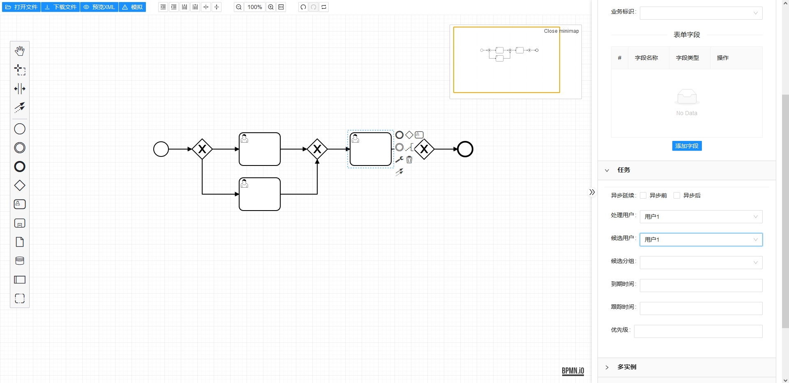

# bpmn-designer-antd

#### 介绍
基于 Bpmn.js、Vue 3.x 、Ant-design-vue 和vite的流程编辑器，支持监听器，扩展属性，表单等配置，可自由扩展，欢迎PR一起完善

基于大佬 @majinhui9 的 [bpmn-vue3](https://github.com/majinhui9/bpmn-vue3) Element-plus版本修改而来


#### 1. 安装依赖

```shell
npm install
// or pnpm install
// or yarn install
```

#### 2. 运行

```shell
npm run dev
```
#### 3. 访问

```shell
浏览器输入 http://localhost:90/
```

运行截图：


### 规范

#### git commit 规范

- `feat` 增加新功能
- `fix` 修复问题/BUG
- `style` 代码风格相关无影响运行结果的
- `perf` 优化/性能提升
- `refactor` 重构
- `revert` 撤销修改
- `test` 测试相关
- `docs` 文档/注释
- `chore` 依赖更新/脚手架配置修改等
- `workflow` 工作流改进
- `ci` 持续集成
- `types` 类型定义文件更改
- `wip` 开发中
- `mod` 不确定分类的修改
- `release` 发布
